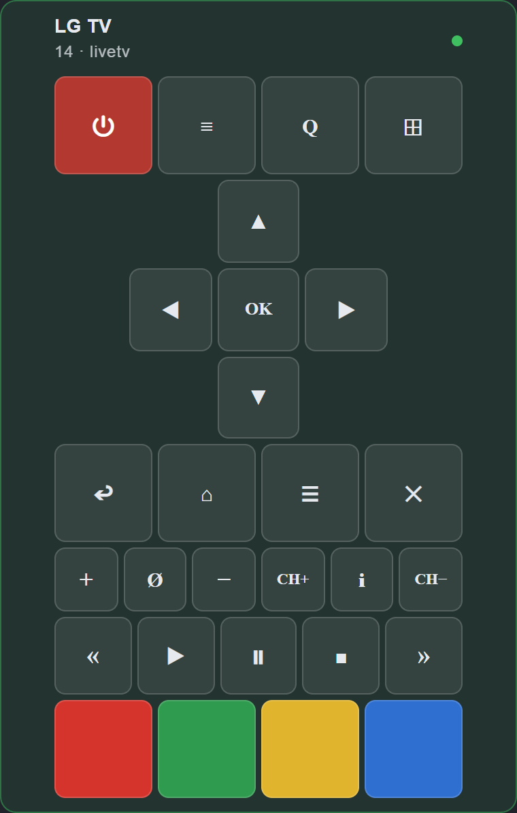

# ioBroker.lgtv

**Tests:** 

LG WebOS SmartTV adapter for ioBroker

Remote controlling an LG WebOS SmartTV (2013 models and higher) from [ioBroker](https://www.iobroker.net).

---

## Usage:

Install the adapter through the ioBroker admin interface.
In the adapter config input the ip address of your LG WebOS TV.
At first connection you will receive a pairing prompt on your TV screen where you should allow the connection.

### Polling

Some TVs disconnect from the web socket when the TV is turned off and do not report this to the adapter correctly. Then additional polling is required. You can define the time in settings. If the value is empty, the adapter tries to detect this automatically:
On adapter restart the polling (every 60 sec) is active until the first correct TV off event is detected.

## Some examples:

`setState('lgtv.0.states.popup', 'Some text!');`

This will show a popup with the text "Some text!" on the TV.
You can use HTML linebreaks (br) in the text.

`setState('lgtv.0.states.turnOff', true);`

Switching off the TV.

`setState('lgtv.0.states.mute', true);`

Mute the TV.

`setState('lgtv.0.states.mute', false);`

Unmute the TV.

`setState('lgtv.0.states.volumeUp', true);`

This will increase the volume of the TV.

`setState('lgtv.0.states.volumeDown', true);`

Decreasing the volume of the TV.

`setState('lgtv.0.states.channelUp', true);`

Increasing the current TV channel.

`setState('lgtv.0.states.channelDown', true);`

Decreasing the current TV channel.

`setState('lgtv.0.states.3Dmode', true);`

Activates the 3D mode on the TV

`setState('lgtv.0.states.3Dmode', false);`

Deactivates the 3D mode on the TV.

`setState('lgtv.0.states.channel', 7);`

Switching the live TV to channel number 7.

`setState('lgtv.0.states.launch', 'livetv');`

Switching to Live TV mode.

`setState('lgtv.0.states.launch', 'smartshare');`

Opening the SmartShare App on the TV.

`setState('lgtv.0.states.launch', 'tvuserguide');`

Runs the TV User Guide App on the TV.

`setState('lgtv.0.states.launch', 'netflix');`

Opening the Netflix App on the TV.

`setState('lgtv.0.states.launch', 'youtube');`

Opens the Youtube App on the TV.

`setState('lgtv.0.states.launch', 'prime');`

Opens the Amazon Prime App on the TV.

`setState('lgtv.0.states.launch', 'amazon');`

On some TVs this command opens the Amazon Prime App.

`setState('lgtv.0.states.openURL', 'http://www.iobroker.net');`

Opens the Webbrowser on the TV and navigates to www.iobroker.net.
Can also be used to open images or videos (in the browser).

`setState('lgtv.0.states.input', 'av1');`

Switches the input on the TV to AV1.

`setState('lgtv.0.states.input', 'scart');`

Switches the input on the TV to Scart.

`setState('lgtv.0.states.input', 'component');`

Switches the input oh the TV to Component.

`setState('lgtv.0.states.input', 'hdmi1');`

Switches the input oh the TV to HDMI 1.

`setState('lgtv.0.states.input', 'hdmi2');`

Switches the input oh the TV to HDMI 2.

`setState('lgtv.0.states.input', 'hdmi3');`

Switches the input oh the TV to HDMI 3.

`setState('lgtv.0.states.youtube', 'https://www.youtube.com/watch?v=AjSpMQfRmEo'); OR setState('lgtv.0.states.youtube', 'AjSpMQfRmEo');`

Play YouTube video.

`setState('lgtv.0.states.raw', '{"url": "ssap://system.launcher/launch", "cmd": "{id: 'netflix'}" }');`
`setState('lgtv.0.states.raw', '{"url": "ssap://api/getServiceList", "cmd": ""}');`

Sending and response RAW command API.

`setState('lgtv.0.remote.*KEY*', true);`

Send remote KEY to TV.

`setState('lgtv.0.states.power', true/false);`

Turn Off TV and Turn On TV (TurnOn, works only LAN, using WOL).

`setState('lgtv.0.states.soundOutput', 'external_arc');`

Switch audio output through ARC (HDMI).

---

## States

`channel`

holds the current channel

`volume`

holds the current volume level and can change the volume

`on`

it is true when TV is on and false if TV is off

---

## Remote control widget for `ioBroker.devices`

The adapter ships a **Control TV** widget for the `devices` adapter. Add it there via
*Add widget → Control TV*, pick the lgtv instance, and the widget drives the `remote.*` states
of that instance directly. The status line shows the current volume, the mute state and the
running app; the dot in the corner reflects `states.on`.

The power key follows `remote.power`: it sends the POWER button while the TV is on and a
Wake-on-LAN packet while it is off.

| Compact (1x1)                              | Wide (2x0.5)                         | Full remote (2x1 / 2x2)                     |
|--------------------------------------------|--------------------------------------|---------------------------------------------|
|  |  |  |

The channel keys, media keys, colour keys and the number pad can each be switched off in the
widget settings.

---
## Installation

Install this adapter using ioBroker repositories.

>[!NOTE]
> This adapter does not support installation from GitHub.

## Changelog

<!--
    Placeholder for the next version (at the beginning of the line):
    ### **WORK IN PROGRESS**
-->
### **WORK IN PROGRESS**
- (Voodoo2man) Fix WebOS 26 pairing with a generic manifest and persist the pairing key across reconnects.

### 3.0.1 (2026-09-04)
- (GermanBluefox) Removed prepare script

### 3.0.0 (2026-09-04)
- (Voodoo2man) Add WebOS 26 compatibility.
- (Voodoo2man) Use the configured MAC address as a fallback for Wake-on-LAN.
- (GermanBluefox) A malformed MAC address or a Wake-on-LAN socket error does not terminate the adapter anymore
- (GermanBluefox) The MAC address is validated in the admin configuration
- (GermanBluefox) Added the missing default value for the `wolwithip` setting
- (GermanBluefox) `remote.power` switches the TV off again instead of only sending Wake-on-LAN
- (GermanBluefox) Migrated the connection options from the deprecated `wsconfig` block to the lgtv2 v2 option names
- (GermanBluefox) Removed the process wide TLS bypass, the certificate check is now relaxed per connection only
- (GermanBluefox) Removed the unused `websocket` dependency
- (GermanBluefox) The adapter was refactored to TypeScript. The sources moved to `src/`, the published code is the compiled `build/`
- (GermanBluefox) The admin translations moved from `admin/i18n/<lang>/translations.json` to the flat `admin/i18n/<lang>.json`
- (GermanBluefox) The unit tests use `node:assert` instead of `chai`
- (GermanBluefox) Added a "Control TV" remote-control widget for the `ioBroker.devices` adapter

### 2.7.4 (2026-06-18)
- (mcm1957) Compact mode has been disabled due to usage of process.env
- (mcm1957) Dependencies have been updated

### 2.7.3 (2026-06-03)
 - (arteck) fix uncaught exception: Parameter "timeout"
 - (krobipd) Removed the eyeComfortMode boolean-migration

### 2.7.2 (2026-05-11)
- (krobipd) Reconnect watchdog no longer warns and recreates the LGTV instance while the TV is simply switched off. [#419]

[Older changelogs can be found there](CHANGELOG_OLD.md)

## License

MIT License

Copyright (c) 2024-2026 iobroker-community-adapters <iobroker-community-adapters@gmx.de>  
Copyright (c) 2023 Sebastian Schultz.

Permission is hereby granted, free of charge, to any person obtaining a copy
of this software and associated documentation files (the "Software"), to deal
in the Software without restriction, including without limitation the rights
to use, copy, modify, merge, publish, distribute, sublicense, and/or sell
copies of the Software, and to permit persons to whom the Software is
furnished to do so, subject to the following conditions:

The above copyright notice and this permission notice shall be included in
all copies or substantial portions of the Software.

THE SOFTWARE IS PROVIDED "AS IS", WITHOUT WARRANTY OF ANY KIND, EXPRESS OR
IMPLIED, INCLUDING BUT NOT LIMITED TO THE WARRANTIES OF MERCHANTABILITY,
FITNESS FOR A PARTICULAR PURPOSE AND NONINFRINGEMENT. IN NO EVENT SHALL THE
AUTHORS OR COPYRIGHT HOLDERS BE LIABLE FOR ANY CLAIM, DAMAGES OR OTHER
LIABILITY, WHETHER IN AN ACTION OF CONTRACT, TORT OR OTHERWISE, ARISING FROM,
OUT OF OR IN CONNECTION WITH THE SOFTWARE OR THE USE OR OTHER DEALINGS IN
THE SOFTWARE.
